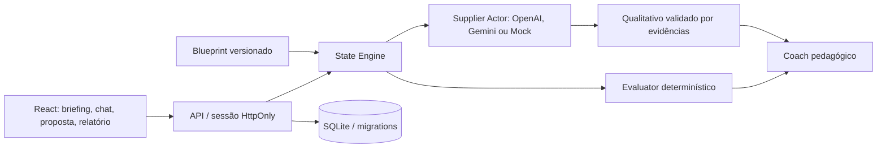

# Arquitetura

O fluxo principal agora é a compra paramétrica de alumínio. A extensão de domínio, migração aditiva, fornecedores independentes e histórico estão descritos em [Alumínio](aluminum.md). O desenho abaixo continua válido; o cenário K-17 permanece para compatibilidade.

TanStack Start/React/Tailwind preservados. Nitro usa `node-server`; o wrapper SSR encaminha `/api/*` ao servidor da simulação.

## Separação

- `domain/scenario.ts`: projeção pública, mandato, dossiê e pesos.
- `server/scenario.server.ts` + `rules.server.ts`: blueprint privado v2.0.0, escada, pacotes, eventos, matriz e coeficientes.
- `engine.server.ts`: estados, ações, PRNG, abertura, degraus e sorteios.
- `providers.server.ts`: MockSimulationProvider, OpenAISimulationProvider, GeminiSimulationProvider (mesmas instruções e payload de contexto), Structured Outputs e validação.
- `evaluator.server.ts`: viabilidade, pontuação objetiva e enumeração do melhor resultado.
- `qualitative.server.ts`: fallback por ações e trechos observados.
- `coach.server.ts`: relatório pedagógico.
- `store.server.ts`: banco inacessível diretamente pelo frontend.

O modelo recebe perfil, conversa limitada, oferta autorizada e informações reveláveis. Não recebe piso nem estados numéricos; o motor os controla. Texto gerado não pode introduzir valores numéricos: o servidor anexa condições públicas. Isso restringe liberdade verbal para preservar consistência.

## API

`POST /api/simulations` exige JSON, Origin igual à aplicação e UUID em `Idempotency-Key`.

| action   | Campos                      | Resultado                       |
| -------- | --------------------------- | ------------------------------- |
| start    | config                      | execução pública                |
| message  | runId, text, expectedTurn   | snapshot e eventos              |
| notes    | runId, notes                | confirmação                     |
| finalize | runId, offer, accepted:true | resultado; avaliação persistida |
| evaluate | runId                       | avaliação final existente       |
| retry    | runId, sameSeed             | nova execução                   |
| share    | runId                       | token do relatório              |

`GET /api/simulations/:id` exige sessão proprietária. `GET /api/reports/:token` entrega somente relatório final. Erros estruturados: `error.code`, `error.message`.

## Persistência

Migration `001_initial.sql` cria oito entidades de domínio, sessões, controle de versão, rate limits e idempotência. A API aplica a migration automaticamente. UUID de execução independe da seed. Token de sessão tem 256 bits e é armazenado por hash.

Operações de cada sessão são serializadas. Turno esperado impede conflitos entre abas. Transação grava execução, mensagens, snapshot, sorteios e resposta idempotente juntos; repetição retorna a mesma resposta. Não existe transação aberta durante chamada à IA. Requer **um processo servidor**; múltiplas instâncias precisam de coordenação distribuída.

Snapshots registram estado público/privado e provider utilizado. Eventos registram probabilidade, sorteio e resultado, inclusive não ocorrência. SQLite não tem RLS: banco é exclusivo do servidor e consultas filtram o proprietário.

Deploy requer Node com volume persistente. O ambiente Lovable pode fixar Cloudflare, incompatível com `node:sqlite`. Para publicar ali, substituir Store por Postgres/Supabase ou banco compatível. Não houve publicação.

Referência da integração: [documentação oficial OpenAI de Structured Outputs](https://developers.openai.com/api/docs/guides/structured-outputs), consultada em 15/09/2026.
